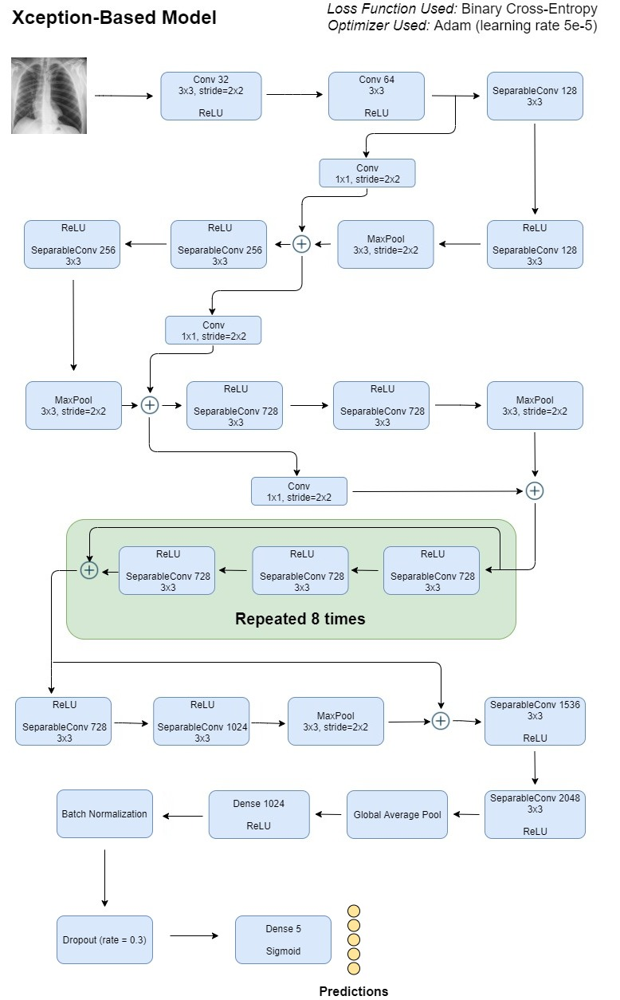
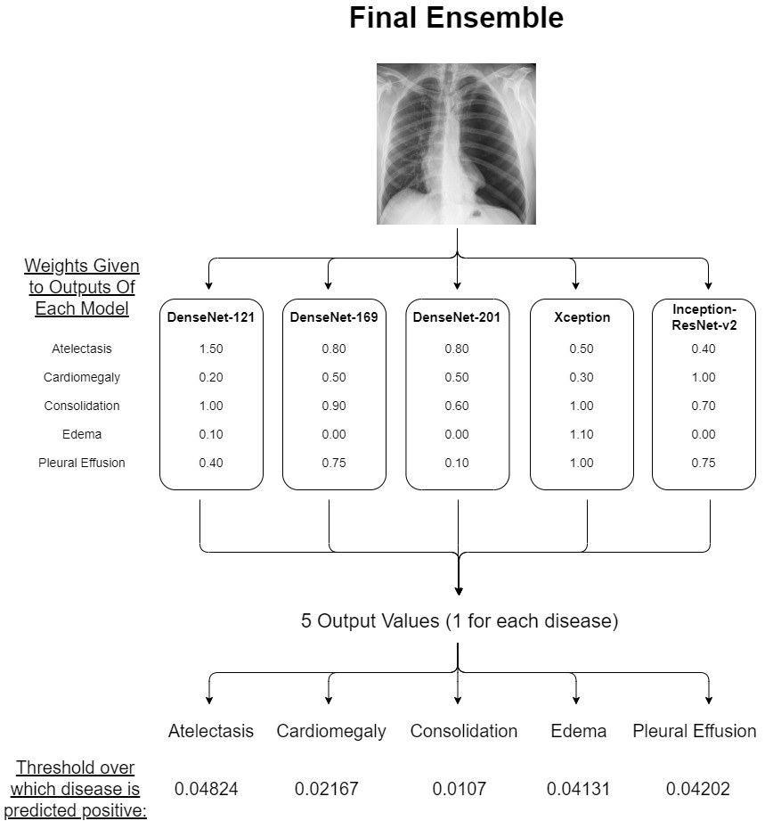

# X-Ray Anomaly Detection Models

This repository is planned to host, the codes for refining the data set, building the models and fine tuning them to deliver accurate results in detecting anomalies in **Chest X-Rays**.

## Detailed Aim Of This Repository

* Construct a preliminary *CNN* for deep learning from *Chest X-Rays* **(CXRs)**.
* Experiment with a few *CXR datasets* to try to understand which one is optimal for the project. Considering computational limitations as well as accuracy targets determine which dataset will be used.
* Select the dataset, and also decide whether the entire dataset will be required. If not, select the subset of data to be used.
* Work on *image preprocessing* and *dataset refining*.
* Try to replicate the performances of the ***state-of-the-art*** papers in **CheXpert competition** into working **Keras** or **PyTorch** models. 
* Save models and document model performances.
* The final aim is to compare all the models developed, and decide if the final model should be just one of the trained models or an ensemble.
* Finalize the **model** for deployment into **RESTful APIs**.

## An Illustration of a Model Pipeline Used (Xception)



## An Illustration of the Final Ensemble



## How To Contribute?

* First of all clone this repo(in case you haven't) :
  ```
  git clone https://github.com/PerXeptron/X-Ray-Anomaly-Detection-Models.git
  cd X-Ray-Anomaly-Detection-Models
  ```

* Then create your own branch for developing stuff on your side :
  ```
  git branch <something-alongwith-your-username-would-be-preferable>
  git checkout <branch-you-just-created>
  ```

* After *modification of existing files*/*addition of new files*, push your branch and open a *pull request* to the master branch so that everyone can review your code before you merge it to the master branch.
  ```
  git push origin <branch-you-had-created>
  ```

## Rules

* **Don't commit directly to the master branch** *(please :p)*

* **Create your own personal folders inside this repo for hosting your model development notebooks.**

## Authors

**sudoRicheek(Richeek)**, **hrshtv(Harshit)**, **praptikumar(Prapti)**, **ankitkmisra(Ankit)**.

**May 2020.**
